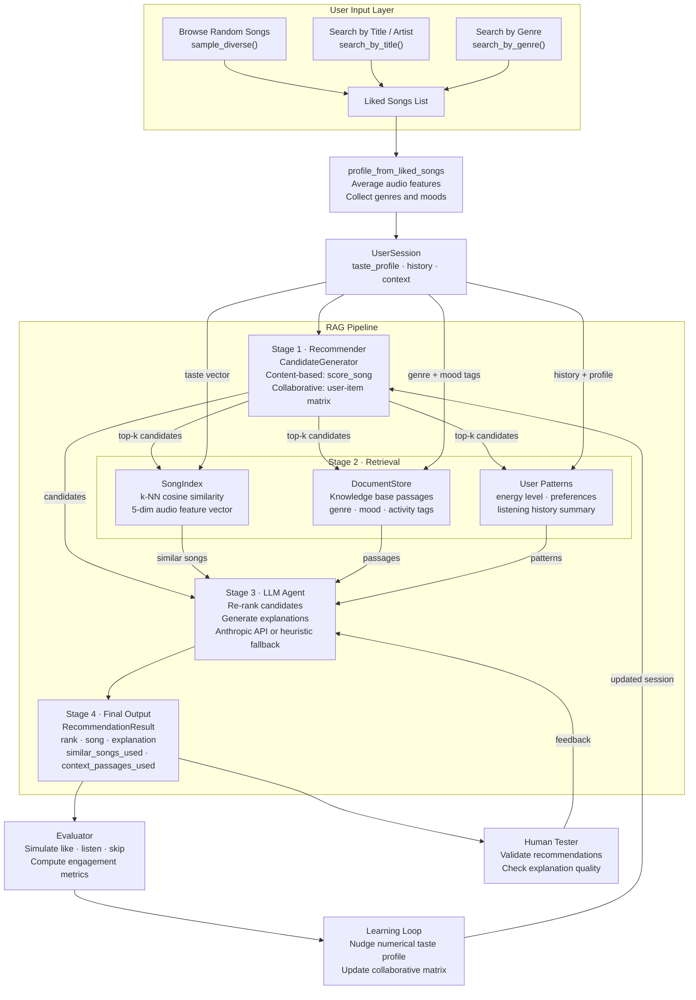

```mermaid
flowchart TD

    subgraph UI["User Input Layer"]
        Browse["Browse Random Songs\nsample_diverse()"]
        SearchT["Search by Title / Artist\nsearch_by_title()"]
        SearchG["Search by Genre\nsearch_by_genre()"]
        Liked["Liked Songs List"]
    end

    Browse --> Liked
    SearchT --> Liked
    SearchG --> Liked

    Liked --> Builder["profile_from_liked_songs\nAverage audio features\nCollect genres and moods"]
    Builder --> Session["UserSession\ntaste_profile · history · context"]

    subgraph Pipeline["RAG Pipeline"]
        direction TB

        Recommender["Stage 1 · Recommender\nCandidateGenerator\nContent-based: score_song\nCollaborative: user-item matrix"]

        subgraph Retrieval["Stage 2 · Retrieval"]
            SongIdx["SongIndex\nk-NN cosine similarity\n5-dim audio feature vector"]
            DocStore["DocumentStore\nKnowledge base passages\ngenre · mood · activity tags"]
            UPat["User Patterns\nenergy level · preferences\nlistening history summary"]
        end

        LLMNode["Stage 3 · LLM Agent\nRe-rank candidates\nGenerate explanations\nAnthropic API or heuristic fallback"]

        OutNode["Stage 4 · Final Output\nRecommendationResult\nrank · song · explanation\nsimilar_songs_used · context_passages_used"]
    end

    Session --> Recommender

    Recommender -->|"top-k candidates"| SongIdx
    Recommender -->|"top-k candidates"| DocStore
    Recommender -->|"top-k candidates"| UPat
    Session -->|"taste vector"| SongIdx
    Session -->|"genre + mood tags"| DocStore
    Session -->|"history + profile"| UPat

    Recommender -->|"candidates"| LLMNode
    SongIdx -->|"similar songs"| LLMNode
    DocStore -->|"passages"| LLMNode
    UPat -->|"patterns"| LLMNode

    LLMNode --> OutNode

    OutNode --> Evaluator["Evaluator\nSimulate like · listen · skip\nCompute engagement metrics"]
    Evaluator --> LearningLoop["Learning Loop\nNudge numerical taste profile\nUpdate collaborative matrix"]
    LearningLoop -->|"updated session"| Recommender

    OutNode --> HumanTester["Human Tester\nValidate recommendations\nCheck explanation quality"]
    HumanTester -->|"feedback"| LLMNode
```
